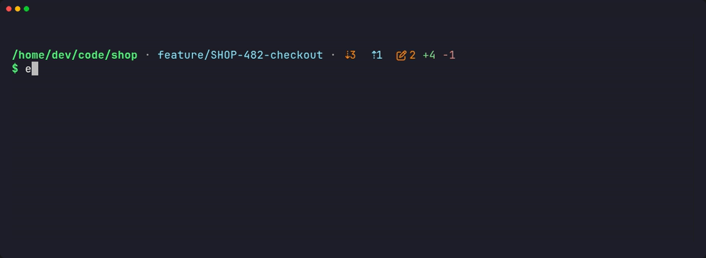
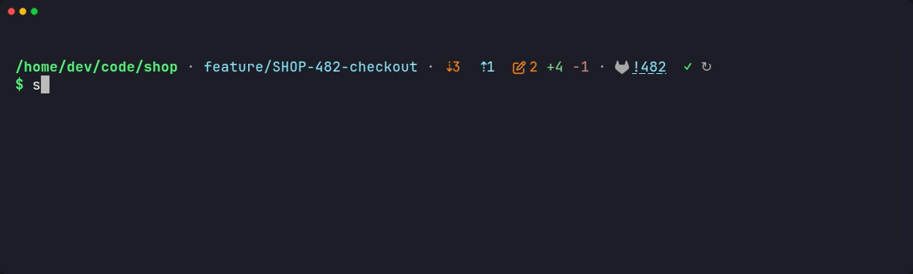
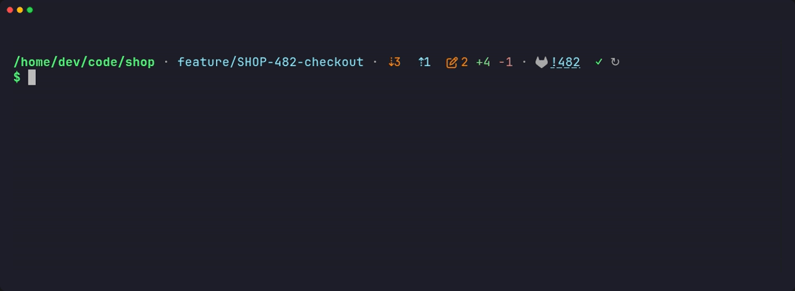

<p align="center">
  
</p>

<p align="center">
  <a href="https://github.com/fmatsos/shellkit/actions/workflows/check.yml"></a>
  
  
  <a href="LICENSE"></a>
</p>

A plain zsh / bash setup for Linux and macOS, with an async, themeable prompt
that keeps every fact on one line and never makes you wait for the network.
There's no framework (no Oh My Zsh, no Oh My Bash) and the first prompt shows in about
40 ms ([measured](#speed)).

<p align="center">
  
</p>

## Features

<p align="center">
  
</p>


- **Async prompt**: local facts are shown right away. Networked data (`git fetch`,
  the merge / pull request and its CI, unhealthy containers) is fetched in the
  background, and the prompt redraws in place when it arrives. You don't need to
  press Enter.
- **Git at a glance**: branch, worktree, ahead / behind, dirty files with a diff
  stat, and a rebase / merge / cherry-pick / bisect in progress with its conflicts.
  Also the ticket of the branch, and the review of its merge / pull request.
- **Built-in blocks that stay quiet**: a compose stack's health, how long the last
  command took, why it failed, `user@host` over SSH. Each shows only when it has
  something to say.
- **Long commands notify you**: a desktop notification when one ends after 30 s.
- **Themes and blocks**: the layout is a format string such as `'{dir} · {git}'`.
  Colors are roles, icons are variables, and a block is a small zsh function.
- **Per-project settings**: another format or palette for one repository and
  everything below it.
- **Plugins**: blocks and themes shared as git repositories. Each is checked
  against a JSON schema, and nothing is fetched or run until you confirm.
- **`shkit`**: one command to change settings, create project files, manage
  plugins and check the setup (`shkit doctor`). It applies every change immediately, so you never edit shell files by hand.
- **Shell comforts**: jump to a visited directory by its name, Esc Esc toggles
  `sudo`, an unlimited shared history with prefix search, and colored `man`.
- **Self-updating**: a background job at startup moves to the latest release,
  at most once a day. Only versions that passed CI are installed, and local changes
  are never touched.
- **Bash fallback**: the same options and aliases, with a deliberately minimal prompt.
- **Secrets stay out**: machine-specific settings and tokens live in
  `~/.config/shkit/`, never in the repository.

<details>
<summary>More recordings: git states, a long and a failed command, <code>shkit</code> changing the prompt</summary>

<p align="center">
  
</p>

<p align="center">
  
</p>

<p align="center">
  
</p>

</details>

## Quick start

```bash
git clone https://github.com/fmatsos/shellkit.git ~/shellkit
~/shellkit/zsh/try.sh          # try it first: nothing in ~ is touched, nothing is kept
~/shellkit/zsh/install.sh      # links ~/.zshrc and ~/.zshenv, creates ~/.config/shkit
exec zsh
```

Only want the prompt? Keep your own `~/.zshrc` and add one line to it, instead of
running `install.sh`:

```zsh
source ~/shellkit/zsh/prompt.zsh   # the prompt and shkit, nothing else
```

Then shape the prompt:

```zsh
shkit set format '{dir} · {git} · {mr}'   # the info line
shkit set color_accent '38;5;33'           # a color role (an SGR code)
shkit project                              # settings for this repository only…
shkit set -p format '{dir} · {git}'        # …used here and below
shkit show                                 # what is set, where
```

A [Nerd Font](https://www.nerdfonts.com) is recommended for the icons. Symbols
Nerd Font is enough as a fallback font.

## Speed

Measured with [zsh-bench](https://github.com/romkatv/zsh-bench), which types into a
real terminal and times what you see, in a git repository of 10,000 files. Lower is
better. zsh-bench rates a *command lag* under 10 ms as impossible to tell from zero.

**The prompt alone**, each in an otherwise empty `~/.zshrc` (no completion):

| Prompt | First prompt | Command lag | Git info |
|--------|-------------:|------------:|----------|
| shellkit, [prompt only](docs/installation.md#the-prompt-only) | 17 ms | 10 ms | before the prompt shows |
| [starship](https://starship.rs) | 36 ms | 34 ms | before the prompt shows |
| [powerlevel10k](https://github.com/romkatv/powerlevel10k) | 1 ms¹ | 1.4 ms | from a background daemon (gitstatusd) |
| [pure](https://github.com/sindresorhus/pure) | 16 ms | 1.0 ms | after the prompt, redrawn (async) |
| zsh's `vcs_info`, branch only (reference) | 12 ms | 6 ms | branch only |

**A whole setup** (options, history, completion, aliases):

| Setup | First prompt | First command | Command lag |
|-------|-------------:|--------------:|------------:|
| shellkit | 38 ms | 38 ms | 11 ms |
| [Oh My Zsh](https://ohmyz.sh), default theme | 41 ms | 43 ms | 2.9 ms² |
| `compinit` alone (reference) | 13 ms | 14 ms | 0.02 ms |

¹ Its *instant prompt* replays a cached prompt before zsh has loaded; the first command
waits 18 ms. ² zsh-bench detected no git info in Oh My Zsh's default prompt
(`has_git_prompt=0`): its command lag may not include git.

Input lag (a key press to its character) stays under 1 ms for all of them. shellkit's
networked data (fetch, merge request, CI) is never on that path: it runs in the
background, and none of it ran here (the repository has no remote). Mean of 2 runs of 32
iterations each, the ranking the same in both: Docker on Linux, Ubuntu 24.04, zsh 5.9,
Intel Core Ultra 7 165U, 2026-10-02. To run it again: `.github/bench/run.sh`.

## Documentation

Also on the website: <https://fmatsos.github.io/shellkit/docs/>.

| Guide | What's in it |
|-------|--------------|
| [Installation](docs/installation.md) | requirements, Linux and macOS, bash fallback, automatic updates, migrating |
| [Usage](docs/usage.md) | the shell features, aliases and scripts |
| [Configuration](docs/configuration.md) | `~/.config/shkit/`, settings layers, per-project settings, secrets |
| [`shkit` reference](docs/shkit.md) | every command and option |
| [The prompt](docs/prompt.md) | built-in blocks, format syntax, colors, icons, behaviour |
| [Writing a theme](docs/themes.md) | a look of your own, locally or in a plugin |
| [Writing a block](docs/blocks.md) | a new `{segment}`: the contract, background jobs |
| [Plugins](docs/plugins.md) | installing, writing and publishing one; the manifest |
| [Development](docs/development.md) | repository layout, checks, CI, releasing |

## Requirements

| | Linux | macOS |
|---|---|---|
| shell | zsh 5.8+ (bash 5.1+ for the fallback) | the system zsh; `brew install bash` for the fallback |
| `git` | ✓ | ✓ (Command Line Tools or Homebrew) |
| `jq` | `apt install jq` | built in since macOS 15, `brew install jq` before |
| optional | `glab` / `gh` (MR / PR and CI), `docker` | same, via Homebrew |

No GNU coreutils are needed on macOS. See [Installation](docs/installation.md).

## License

Public domain, see [LICENSE](LICENSE) ([Unlicense](https://unlicense.org)).
